```mermaid
erDiagram
    %% ============================================================================
    %% CORE USER ENTITIES
    %% ============================================================================
    
    USER {
        string id PK
        string email
        string name
        string role
        string avatar
        string phone
        string address
        string createdAt
        string lastLogin
        boolean mfaEnabled
    }
    
    %% ============================================================================
    %% PATIENT ENTITIES
    %% ============================================================================
    
    PATIENT_PROFILE {
        string id PK
        string registrationId
        string fullName
        string email
        string phone
        string dateOfBirth
        string bloodGroup
        string address
        string location
        string avatar
        string walletAddress
        string status
        number profileCompletion
        string memberSince
        string createdAt
    }
    
    DOCUMENT {
        string id PK
        string name
        string type
        string status
        string fileUrl
        string uploadedAt
        string verifiedAt
        string rejectionReason
    }
    
    KYC_DATA {
        string status
        number completionPercentage
        string submittedAt
        string verifiedAt
        string rejectionReason
    }
    
    ASSET_DEPOSIT {
        string id PK
        string patientId FK
        string assetType
        number assetValue
        number weight
        string status
        string submittedAt
        string approvedAt
        number tokenAmount
    }
    
    PATIENT_TOKEN_BALANCE {
        string userId PK
        number assetToken
        number healthToken
        number lockedAssetToken
        number lockedHealthToken
        string lastUpdated
    }
    
    HEALTH_BENEFIT {
        string id PK
        string name
        string description
        string category
        number tokenCost
        number htCost
        boolean available
        string provider
        number rating
        string imageUrl
    }
    
    BENEFIT_REDEMPTION {
        string id PK
        string patientId FK
        string benefitId FK
        number tokenSpent
        string status
        string redeemedAt
    }
    
    SUBSCRIPTION_PLAN {
        string id PK
        string name
        number price
        string billingCycle
        string[] features
        boolean popular
    }
    
    SUBSCRIPTION_REQUEST {
        string id PK
        string patientId FK
        string plan
        string status
        string startDate
        string endDate
        boolean autoRenew
    }
    
    %% ============================================================================
    %% HOSPITAL ENTITIES
    %% ============================================================================
    
    HOSPITAL_INFO {
        string id PK
        string name
        string code
        string registrationNumber
        string address
        string city
        string state
        string country
        string contactEmail
        string contactPhone
        string status
        string verificationStatus
        string createdAt
    }
    
    ADMIN_ACCOUNT {
        string adminId PK
        string adminName
        string adminEmail
        string adminRole
        string hospitalId FK
        string accountStatus
        string registrationDate
        string lastLoginDate
        string permissions
    }
    
    PATIENT_RECORD {
        string id PK
        string patientId FK
        string hospitalId FK
        string fullName
        string email
        string phone
        string kycStatus
        string accountStatus
        number totalATBalance
        number totalHTBalance
    }
    
    DEPOSIT_REQUEST {
        string id PK
        string depositId
        string patientId FK
        string hospitalId FK
        string assetType
        number weight
        number assetWorth
        number expectedTokens
        string status
        string submittedDate
    }
    
    SUBSCRIPTION_BATCH {
        string id PK
        string batchId
        string hospitalId FK
        string collectionPeriod
        number totalPatients
        number totalAmount
        number expectedTokens
        string status
        string submittedDate
    }
    
    MINT_RECORD {
        string id PK
        string depositId FK
        string patientEmail
        string hospitalId FK
        string assetType
        number weight
        number tokensToMint
        string status
        string mintedDate
        string txHash
    }
    
    TRADE_POSITION {
        string id PK
        string patientId FK
        number atTokens
        string pool
        number investedValue
        number currentValue
        number profitLoss
        number apy
    }
    
    PROFIT_ALLOCATION {
        string id PK
        string patientId FK
        string hospitalId FK
        number tokenProfitAT
        string status
    }
    
    HOSPITAL_FINANCIALS {
        string hospitalId PK
        number totalTokensMinted
        number totalATInCirculation
        number totalHTIssued
        number totalProfitGenerated
        number monthlyRevenue
    }
    
    %% ============================================================================
    %% BANK ENTITIES
    %% ============================================================================
    
    BANK_INFO {
        string id PK
        string bankId
        string bankName
        string swiftCode
        string bankCode
        string registrationNumber
        string address
        string city
        string state
        string country
        string contactEmail
        string contactPhone
        string status
        string verificationStatus
        string createdAt
    }
    
    BANK_OFFICER {
        string officerId PK
        string officerName
        string officerEmail
        string bankId FK
        string department
        string position
        string accountStatus
        string permissions
    }
    
    ASSET {
        string id PK
        string assetId
        string assetType
        number weight
        number purity
        number currentValue
        number purchaseValue
        string location
        string vaultNumber
        string bankId FK
        string hospitalId FK
        string status
        string acquiredDate
    }
    
    POLICY {
        string id PK
        string policyId
        string policyName
        string policyType
        string description
        number coverage
        number premium
        string startDate
        string endDate
        string bankId FK
        string hospitalId
        string status
    }
    
    VERIFICATION_REQUEST {
        string id PK
        string verificationId
        string requestType
        string hospitalId FK
        string scope
        string status
        string priority
        string requestedDate
        string verifiedBy
    }
    
    PATIENT_VERIFICATION {
        string id PK
        string patientId FK
        string hospitalId FK
        string bankId FK
        string kycStatus
        string verificationDate
    }
    
    %% ============================================================================
    %% TOKEN & BLOCKCHAIN ENTITIES
    %% ============================================================================
    
    TOKEN_BALANCE {
        string userId PK
        number totalTokens
        number availableTokens
        number lockedTokens
        string lastUpdated
    }
    
    TOKEN_HISTORY {
        string id PK
        string userId FK
        string type
        number amount
        number balance
        string description
        string timestamp
        string relatedAssetId
    }
    
    TRANSACTION {
        string id PK
        string patientId FK
        string date
        string type
        number amount
        string token
        string status
        string txHash
        string from
        string to
    }
    
    BLOCKCHAIN_TRANSACTION {
        string txHash PK
        string userId FK
        string from
        string to
        number value
        string tokenType
        string timestamp
        number blockNumber
        number confirmations
        string status
    }
    
    HEALTH_TOKEN_TRANSACTION {
        string id PK
        string patientId FK
        string type
        number amount
        string source
        string txHash
        number blockNumber
        string created_at
    }
    
    %% ============================================================================
    %% TRADING & MARKETPLACE ENTITIES
    %% ============================================================================
    
    INVESTMENT_TYPE {
        string id PK
        string name
        string symbol
        number currentPrice
        number change24h
        number volume24h
        number marketCap
        string category
        string description
    }
    
    TRADE {
        string id PK
        string patientId FK
        string timestamp
        string type
        string assetType
        string location
        number open
        number high
        number low
        number close
        number volume
        number liquidity
        number profitLoss
        string status
    }
    
    CHART_DATA_POINT {
        string time
        number open
        number high
        number low
        number close
        number volume
        number liquidity
        number profitLoss
    }
    
    ORDER_BOOK {
        string investmentId PK
        number bidCount
        number askCount
        number spread
        string lastUpdated
    }
    
    ORDER_BOOK_ENTRY {
        string id PK
        string orderbookId FK
        number price
        number volume
        number total
        string side
    }
    
    MARKET_STATS {
        string investmentId PK
        number currentPrice
        number priceChange
        number priceChangePercent
        number totalVolume
        number avgLiquidity
        number totalProfitLoss
        number openTrades
    }
    
    %% ============================================================================
    %% ACTIVITY & AUDIT ENTITIES
    %% ============================================================================
    
    ACTIVITY_TRANSACTION {
        string id PK
        string userId FK
        string tokenType
        number amount
        string status
        string createdAt
    }
    
    NOTIFICATION_ITEM {
        string id PK
        string userId FK
        string title
        string body
        string date
        string type
        string txHash
    }
    
    STATEMENT_ITEM {
        string id PK
        string userId FK
        string month
        number year
        number transactions
        number totalAT
        number totalHT
        string generatedDate
    }
    
    AUDIT_LOG {
        string id PK
        string userId FK
        string action
        string entityType
        string entityId
        string changes
        string timestamp
        string ipAddress
    }
    
    SYSTEM_SETTINGS {
        string settingId PK
        string hospitalId
        number tokenizationFeePercentage
        number minDepositValue
        number maxDepositValue
        boolean autoApprovalEnabled
        string lastModifiedAt
    }
    
    %% ============================================================================
    %% RELATIONSHIPS
    %% ============================================================================
    
    %% User relationships
    USER ||--o{ PATIENT_PROFILE : "is"
    USER ||--o{ ADMIN_ACCOUNT : "is"
    USER ||--o{ BANK_OFFICER : "is"
    USER ||--o{ AUDIT_LOG : "performs"
    USER ||--o{ NOTIFICATION_ITEM : "receives"
    USER ||--o{ STATEMENT_ITEM : "generates"
    
    %% Patient relationships
    PATIENT_PROFILE ||--o{ DOCUMENT : "submits"
    PATIENT_PROFILE ||--o{ ASSET_DEPOSIT : "makes"
    PATIENT_PROFILE ||--o{ BENEFIT_REDEMPTION : "redeems"
    PATIENT_PROFILE ||--o{ SUBSCRIPTION_REQUEST : "subscribes_to"
    PATIENT_PROFILE ||--o{ TRADE : "executes"
    PATIENT_PROFILE ||--o{ TRANSACTION : "makes"
    PATIENT_PROFILE ||--o{ HEALTH_TOKEN_TRANSACTION : "receives"
    PATIENT_PROFILE ||--o{ TOKEN_HISTORY : "owns"
    
    %% Hospital relationships
    HOSPITAL_INFO ||--o{ ADMIN_ACCOUNT : "manages"
    HOSPITAL_INFO ||--o{ PATIENT_RECORD : "maintains"
    HOSPITAL_INFO ||--o{ DEPOSIT_REQUEST : "receives"
    HOSPITAL_INFO ||--o{ SUBSCRIPTION_BATCH : "collects"
    HOSPITAL_INFO ||--o{ MINT_RECORD : "initiates"
    HOSPITAL_INFO ||--o{ PROFIT_ALLOCATION : "allocates"
    
    %% Bank relationships
    BANK_INFO ||--o{ BANK_OFFICER : "employs"
    BANK_INFO ||--o{ ASSET : "secures"
    BANK_INFO ||--o{ POLICY : "issues"
    BANK_INFO ||--o{ VERIFICATION_REQUEST : "verifies"
    
    %% Benefit relationships
    HEALTH_BENEFIT ||--o{ BENEFIT_REDEMPTION : "is_redeemed_for"
    SUBSCRIPTION_PLAN ||--o{ SUBSCRIPTION_REQUEST : "is_requested_for"
    
    %% Asset flow
    ASSET_DEPOSIT ||--o{ DEPOSIT_REQUEST : "becomes"
    DEPOSIT_REQUEST ||--o{ MINT_RECORD : "generates"
    MINT_RECORD ||--o{ TOKEN_HISTORY : "creates"
    
    %% Trading relationships
    INVESTMENT_TYPE ||--o{ TRADE : "is_traded"
    INVESTMENT_TYPE ||--o{ MARKET_STATS : "has"
    INVESTMENT_TYPE ||--o{ ORDER_BOOK : "maintains"
    ORDER_BOOK ||--o{ ORDER_BOOK_ENTRY : "contains"
    
    %% Token relationships
    TOKEN_BALANCE ||--o{ TOKEN_HISTORY : "tracks"
    BLOCKCHAIN_TRANSACTION ||--o{ TOKEN_HISTORY : "records"
    
    %% Cross-domain relationships
    PATIENT_RECORD ||--|| HOSPITAL_INFO : "belongs_to"
    ASSET ||--|| HOSPITAL_INFO : "from"
    ASSET ||--|| BANK_INFO : "secured_by"
    POLICY ||--|| HOSPITAL_INFO : "protects"
    POLICY ||--|| BANK_INFO : "issued_by"
    VERIFICATION_REQUEST ||--|| HOSPITAL_INFO : "verifies"
    PATIENT_VERIFICATION ||--|| HOSPITAL_INFO : "from"
    PATIENT_VERIFICATION ||--|| BANK_INFO : "verified_by"
    
    %% Dependency relationships
    TRADE }o--|| INVESTMENT_TYPE : "involves"
    TRADE_POSITION }o--|| PATIENT_RECORD : "belongs_to"
    TRADE_POSITION }o--|| SUBSCRIPTION_BATCH : "from"
    PROFIT_ALLOCATION }o--|| TRADE_POSITION : "calculates_from"
    TRANSACTION }o--|| TOKEN_BALANCE : "updates"
    HEALTH_TOKEN_TRANSACTION }o--|| PATIENT_TOKEN_BALANCE : "updates"
```

## Key Entities by Domain

### Patient Domain
- **PatientProfile**: Core patient information with identity and contact details
- **Document**: KYC documents (identity, address, financial, asset)
- **AssetDeposit**: Physical asset deposits (gold/silver)
- **PatientTokenBalance**: Token holdings and locks
- **HealthBenefit**: Marketplace health benefits
- **BenefitRedemption**: Token redemptions for benefits
- **SubscriptionRequest**: Monthly/quarterly/annual subscriptions

### Hospital Domain
- **HospitalInfo**: Hospital registration and contact details
- **AdminAccount**: Hospital admin/staff accounts with permissions
- **PatientRecord**: Hospital-managed patient records
- **DepositRequest**: Hospital deposit approvals
- **SubscriptionBatch**: Batch subscription collections
- **MintRecord**: Token minting records
- **TradePosition**: Active trading positions
- **ProfitAllocation**: Monthly profit distributions

### Bank Domain
- **BankInfo**: Bank registration and details
- **BankOfficer**: Bank staff with verification permissions
- **Asset**: Secured physical assets (gold/silver)
- **Policy**: Insurance and compliance policies
- **VerificationRequest**: KYC and deposit verifications
- **PatientVerification**: Cross-domain patient verification

### Token & Blockchain Domain
- **TokenBalance**: User token holdings
- **TokenHistory**: Transaction history
- **Transaction**: Token transactions (Deposit, Mint, Trade, Redeem)
- **BlockchainTransaction**: On-chain transaction records
- **HealthTokenTransaction**: Health token specific transactions

### Trading & Marketplace Domain
- **InvestmentType**: Available investment products
- **Trade**: Executed trades with OHLC data
- **ChartDataPoint**: Candlestick chart visualization data
- **OrderBook**: Buy/Sell orders
- **MarketStats**: Real-time market statistics

### Activity & Audit Domain
- **AuditLog**: User action logs
- **NotificationItem**: User notifications
- **StatementItem**: Monthly statements
- **SystemSettings**: Platform configuration

## Key Relationships

1. **User Hierarchy**: User → PatientProfile/AdminAccount/BankOfficer
2. **Asset Flow**: PatientProfile → AssetDeposit → DepositRequest → MintRecord → TokenHistory
3. **Token Distribution**: MintRecord → TokenBalance → Trade → ProfitAllocation
4. **Verification Chain**: Patient → Document → KYCData → PatientVerification → Bank
5. **Trading Pipeline**: InvestmentType → Trade → TradePosition → ProfitAllocation
6. **Cross-Domain**: Hospital ← → Bank (verification, policy, asset security)

## Business Flows

1. **Deposit & Tokenization**: Patient deposits asset → Hospital approves → Bank secures → Tokens minted
2. **Trading & Profit**: Tokens → Trading pool → Profit generation → Distribution to patients
3. **Redemption**: Patient redeems tokens → HealthBenefit → Completion tracked in TokenHistory
4. **Subscription**: Patient subscribes → SubscriptionBatch collected → Tokens minted → Profit sharing
5. **Verification**: Patient KYC → Bank verification → Compliance tracking
```
